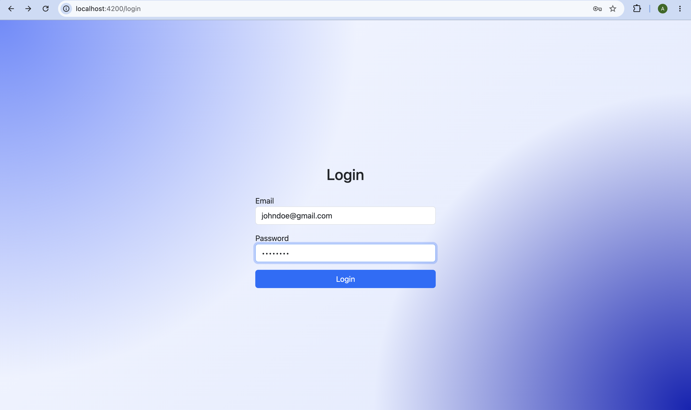
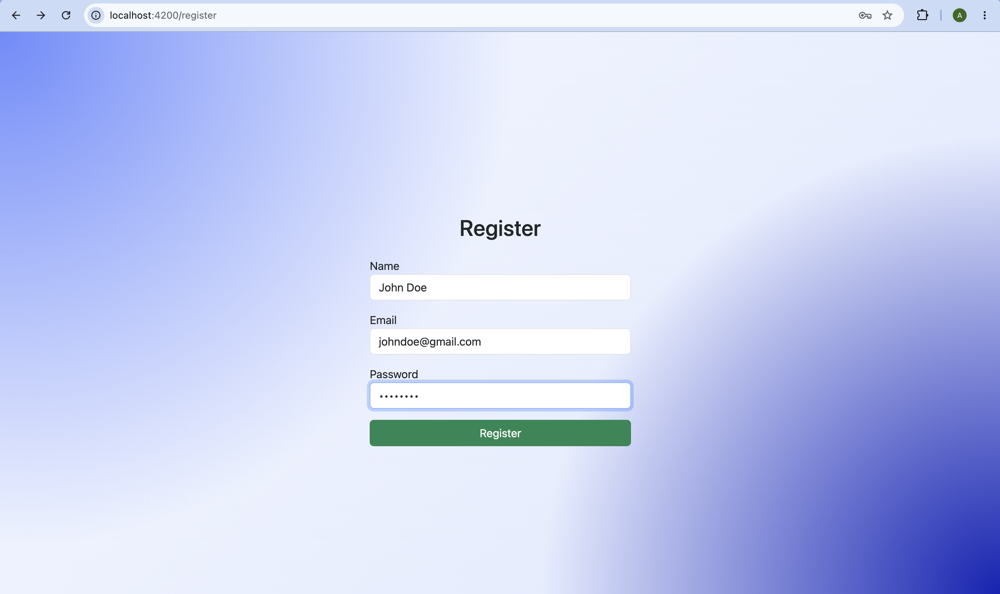
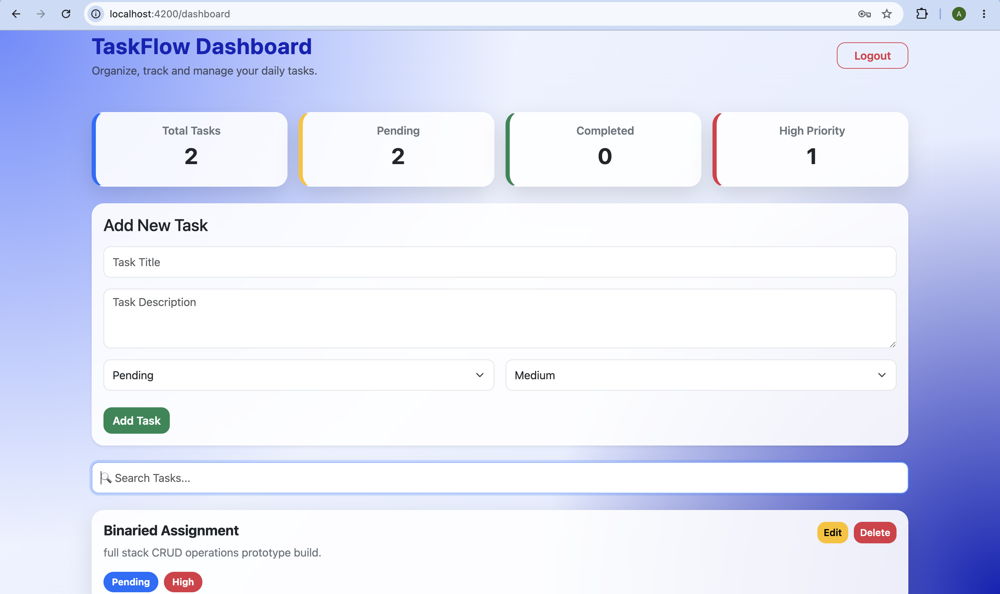
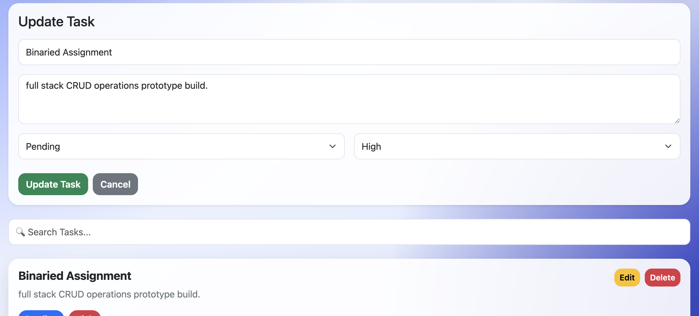
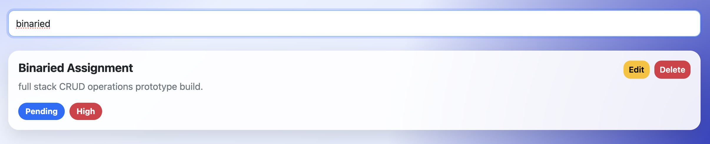

# 📌 TaskFlow

A full-stack Task Management application built with **Angular 19**, **Node.js**, **Express.js**, and **MongoDB Atlas**.

TaskFlow allows users to securely manage their daily tasks with authentication, CRUD operations, search functionality, and task statistics through a clean and responsive user interface.

---

## 🚀 Features

### Authentication
- User Registration
- User Login
- Password hashing using bcrypt
- JWT-based Authentication
- Protected Routes
- Secure Logout

### Task Management
- Create Tasks
- View Tasks
- Update Tasks
- Delete Tasks
- Inline Task Editing
- Search Tasks
- Task Statistics Dashboard

### User Interface
- Responsive Design
- Modern Glassmorphism UI
- Snackbar Notifications
- Dashboard with Statistics Cards
- Search Bar
- Mobile Friendly Layout

---

## 🛠️ Tech Stack

### Frontend
- Angular 19
- TypeScript
- SCSS
- Bootstrap
- Angular Material

### Backend
- Node.js
- Express.js

### Database
- MongoDB Atlas
- Mongoose

### Authentication
- JWT (JSON Web Token)
- bcrypt

---

## 📂 Project Structure

```
TaskFlow/
│
├── backend/
│   ├── controllers/
│   ├── middleware/
│   ├── models/
│   ├── routes/
│   ├── server.js
│   └── .env
│
├── frontend/
│   ├── src/
│   │   ├── app/
│   │   │   ├── pages/
│   │   │   ├── services/
│   │   │   ├── guards/
│   │   │   ├── interceptors/
│   │   │   └── shared/
│   │   └── assets/
│   └── angular.json
│
└── README.md
```

---

# ⚙️ Setup Instructions

## 1. Clone the Repository

```bash
git clone <repository-url>
```

---

## 2. Install Backend Dependencies

```bash
cd backend
npm install
```

---

## 3. Configure Environment Variables

Create a `.env` file inside the backend folder.

Example:

```env
PORT=5001
MONGO_URI=your_mongodb_connection_string
JWT_SECRET=your_secret_key
```

---

## 4. Start Backend

```bash
npm start
```

Backend runs on:

```
http://localhost:5001
```

---

## 5. Install Frontend Dependencies

```bash
cd frontend
npm install
```

---

## 6. Run Angular

```bash
ng serve
```

Frontend runs on:

```
http://localhost:4200
```

---

# 📷 Application Screenshots

*(Add screenshots here if desired.)*

Example:

- Login Page
- Register Page
- Dashboard
- Task CRUD
- Search Functionality

---

# 🤖 AI Tools Used

The following AI tools were used during development:

- ChatGPT
- Claude

---

# 💡 Where AI Helped

AI was used as a development assistant for:

- Debugging issues
- Explaining Angular concepts
- Improving UI styling
- Code refactoring suggestions
- README preparation
- General development guidance

---

# 👨‍💻 What I Implemented Myself

The application logic and implementation were completed by me, including:

- Application architecture
- Backend API development
- Authentication workflow
- JWT integration
- MongoDB schema design
- CRUD functionality
- Angular components
- Services
- Route Guards
- HTTP Interceptors
- Dashboard implementation
- UI customization
- Testing and debugging

AI was used only as a development assistant and all code was reviewed, integrated, tested, and modified by me where necessary.

---

# ⚠️ Challenges Faced

Some of the challenges encountered during development were:

- Integrating JWT authentication between Angular and Express
- Managing protected routes
- Implementing inline task editing
- Maintaining state after CRUD operations
- Designing a clean and responsive UI
- Handling API errors gracefully

---

# 🚀 Future Improvements

Given more time, I would add:

- Task categories
- Due dates and reminders
- Dark Mode
- Drag-and-drop task management
- Pagination
- Task sorting and filtering
- Profile management
- Unit and integration tests
- Docker support
- Deployment using Render and Vercel

---

# 📷 Application Screenshots

## Login


## Register


## Dashboard


## Create/Update Task


## Search


---

# 📄 License

This project was developed as part of an internship assignment for educational and evaluation purposes.
